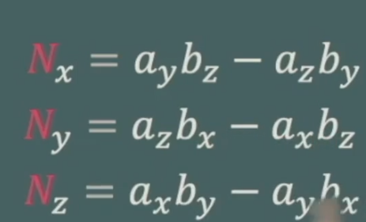
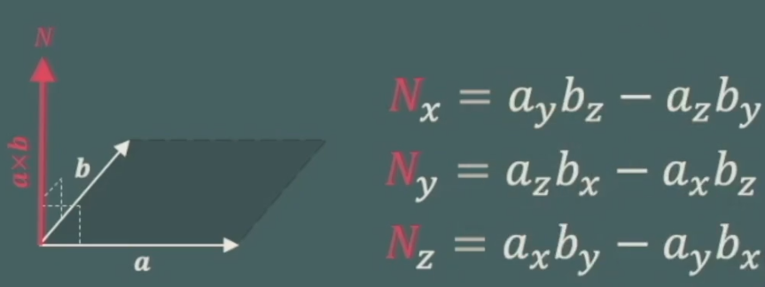
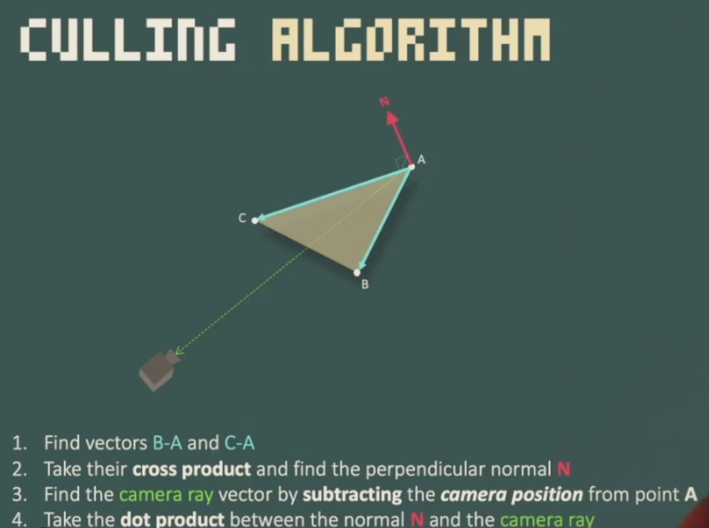

# Vector Operations

## Back-face Culling Motivation

## Vector Magnitude


## Vector Cross Product

  




## Back-face Culling Algorithm




## Back-face Culling Code

```c++

vec3_t vector_a = transformed_vertexs[0]; /*   A   */
vec3_t vector_b = transformed_vertexs[1]; /*  / \  */
vec3_t vector_c = transformed_vertexs[2]; /* B---C */

vec3_t vector_ab = vector_b.sub(vector_a);
vec3_t vector_ac = vector_c.sub(vector_a);
vector_ab.normalize();
vector_ac.normalize();

// Compute the normal of the face
vec3_t normal = vector_ab.cross(vector_ac);
normal.normalize();
// Find the vector between a point in the triangle and the camera
vec3_t camera_ray = camera_position.sub(vector_a);

// Calculate how aligned the camera ray is with the face normal 
float dot_normal_camera = normal.dot(camera_ray);

if (dot_normal_camera < 0) {
	continue;
}
```


